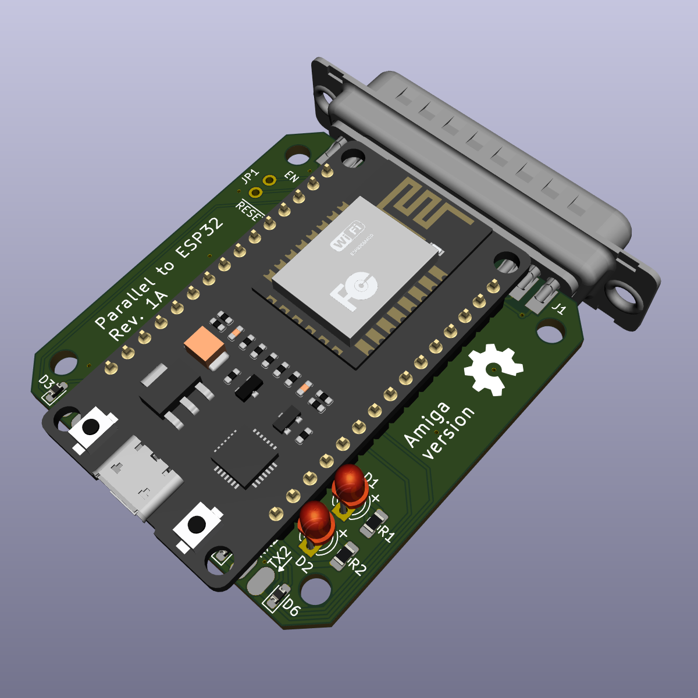
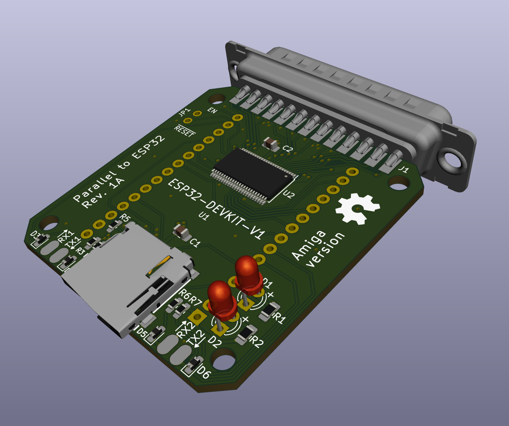
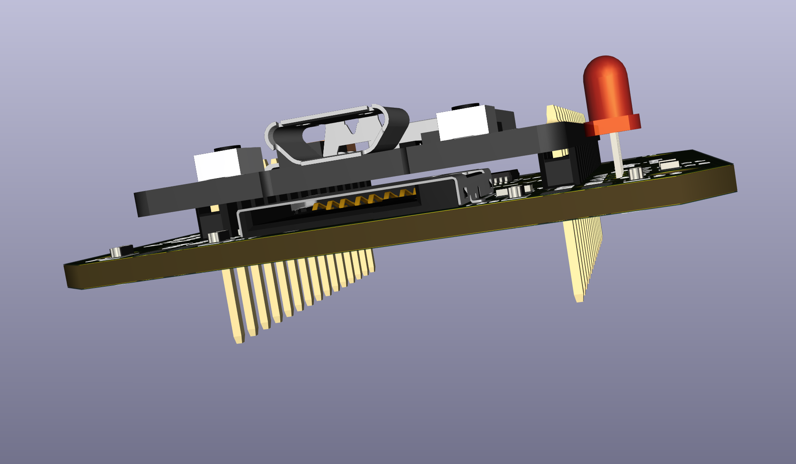
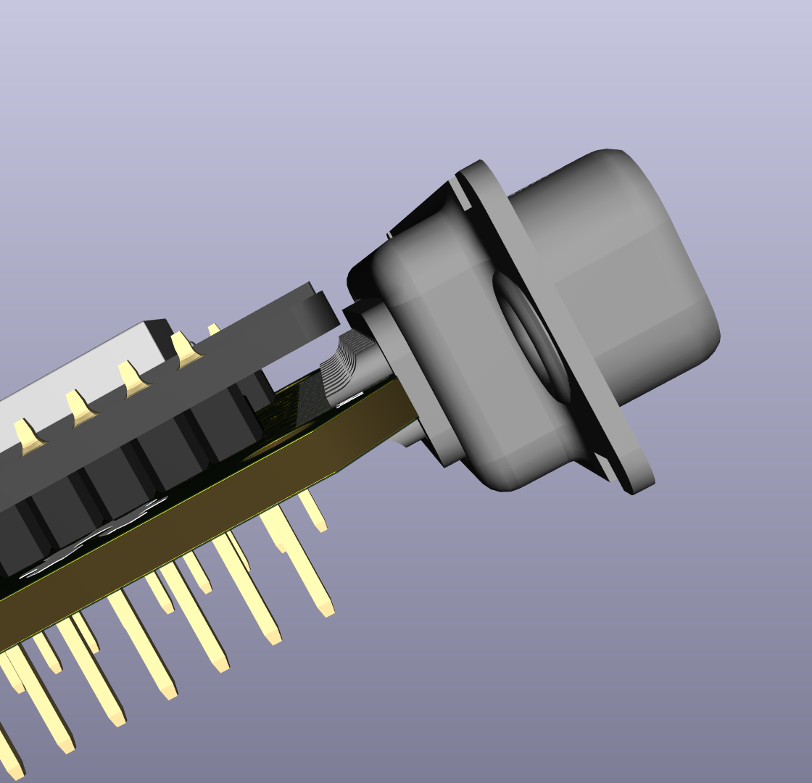

# Parallel_to_ESP32
A parallel to ESP32 project for the Amiga

***

This carrier board is made to host the popular ESP32-DEVKIT-V1 board widely available for a few bucks on AliExpress and the likes. Powering the board can be done by taking +5V from the Amigas external floppy port and connect it to the DEVKIT's Micro-USB jack.

***

Revision 1A
 

 

 

 

***
