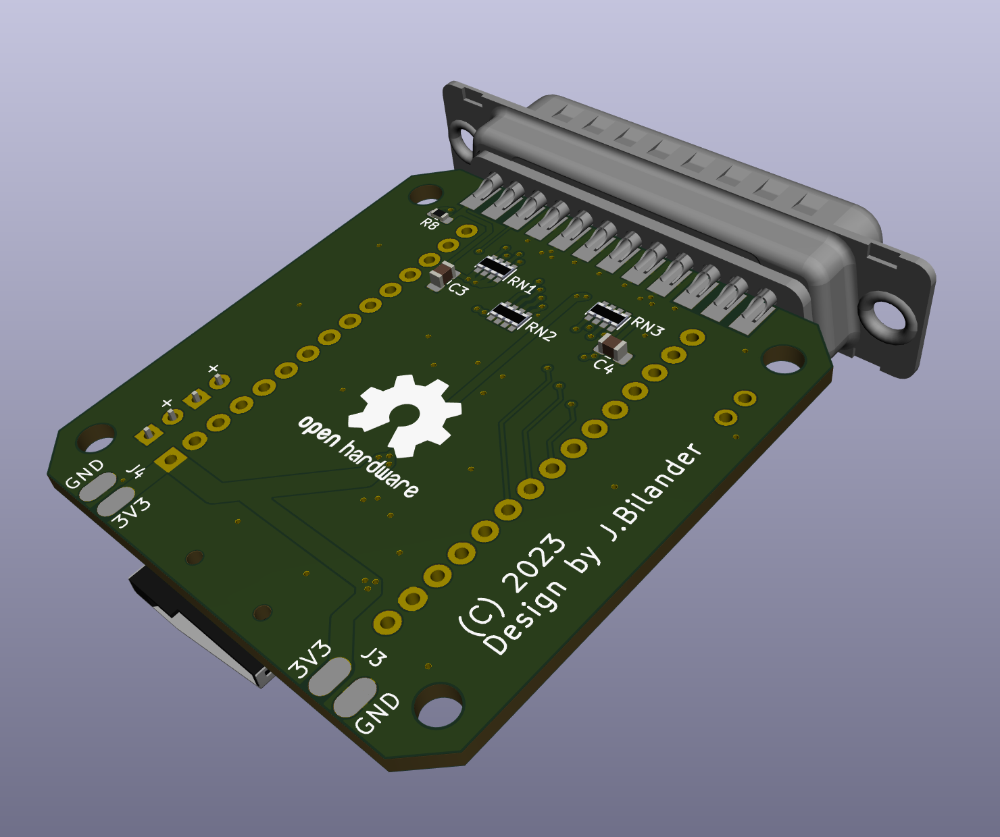

# Parallel_to_ESP32
A parallel to ESP32 project for the Amiga

***

This carrier board is made to host the popular ESP32-DEVKIT-V1 board widely available for a few bucks on AliExpress and the likes. Powering the board can be done by taking +5V from the Amigas external floppy port and connect it to the DEVKIT's Micro-USB jack.

***

Revision 1A
 

 

 

 

***

BOM Rev. 1A
---------
Designator  | Name/Value   | Package | Notes
-|-|-|-|
U1 | ESP32-DEVKIT-V1 | DIP-30 | Please note tested variant is Type/Color:  [ESP32-CP2102-MICRO](https://www.aliexpress.com/item/1005004337178335.html)
U2 | SN74CB3T16210DGGR | TSSOP-48  | [SN74CB3T16210DGGR](https://www.mouser.com/ProductDetail/595-SN74CB3T16210DGG)
J1 | D-Sub DB25 Male connector | EdgeMount, parallel port connector solder type | [D-Sub DB25M](https://www.aliexpress.com/item/32974759586.html)
J2 | Sunrom Micro SD Card Holder | 9-pin Micro SD card slot connector | [Sunrom Micro-SD card holder](https://www.aliexpress.com/item/32802051702.html)
J3 | PinHeader 2x02 | EdgeMount, PinHeader_2x02_P2.54mm | UART1 connector PADs with 3V3/GND Power connectors on the underside for external powering a [RS-232 device](https://www.aliexpress.com/item/1005001685534114.html) or similar from the ESP32
J4 | PinHeader 2x02 | EdgeMount, PinHeader_2x02_P2.54mm | UART2 connector PADs with 3V3/GND Power connectors on the underside for external powering a [RS-232 device](https://www.aliexpress.com/item/1005001685534114.html) or similar from the ESP32
R1 | ~150 Ω Resistor | 0805, 200 mW | (Mandatory if D1 populated) Series resistor for D1 LED, adjust R-value to your type of LED and preferred brightness
R2 | ~150 Ω Resistor | 0805, 200 mW | (Mandatory if D2 populated) Series resistor for D2 LED, adjust R-value to your type of LED and preferred brightness
R3,R4,R6,R7 | LED Resistor 1k Ω | 0603 | [RC0603FR-071KL](https://www.mouser.com/ProductDetail/603-RC0603FR-071KL)
R5 | Resistor 10k or 4.7k Ω | 0603 | Pull-up resistor for Card Present/Detect, signal grounded when card is present in socket
R8 | Resistor 4.7k Ω or 10k Ω | 0603 | Pull-up resistor (on 5V side) for /STROBE-signal  [RC0603FR-074K7L](https://www.mouser.com/ProductDetail/603-RC0603FR-074K7L)
RN1-RN3 | CAY16-4701F4LF Resistor pack 4.7k or 10k Ω (CAY16-103J4LF) | 1206 | [CAY16-4701F4LF](https://www.mouser.com/ProductDetail/652-CAY16A-4701F4LF) Optional Pull-up resistors for Signals: ACK,BUSY,POUT,SELECT,Data0-Data7
D1 (Optional) | LED 3mm | PinHeader_1x02_P2.54mm_Vertical, pin pitch 2.54 mm | [Activity LED indicator](https://www.aliexpress.com/item/1005001688927024.html) (Diffused Orange / Amber or whatever colour you prefer)
D2 (Optional) | LED 3mm | PinHeader_1x02_P2.54mm_Vertical, pin pitch 2.54 mm | [Power LED indicator](https://www.aliexpress.com/item/1005001688927024.html) (Green Diffused or whatever colour you prefer)
D3-D6 | SMD LED | 0603 | [SMD LED 0603](https://www.aliexpress.com/item/1005003836509392.html)
C1-C4 | Capacitor 0.1uF = 100nF | 0805 |
JP1 (Optional) | PinHeader 1x02 | PinHeader_1x02_P2.54mm_Vertical | Shunt on to enable reset ESP32 in conjunction with Ctrl-Amiga-Amiga, Note pressing the RESET-button on the ESP32 will also assert the RESET, be careful, know what you're doing if you enable this one.

***
